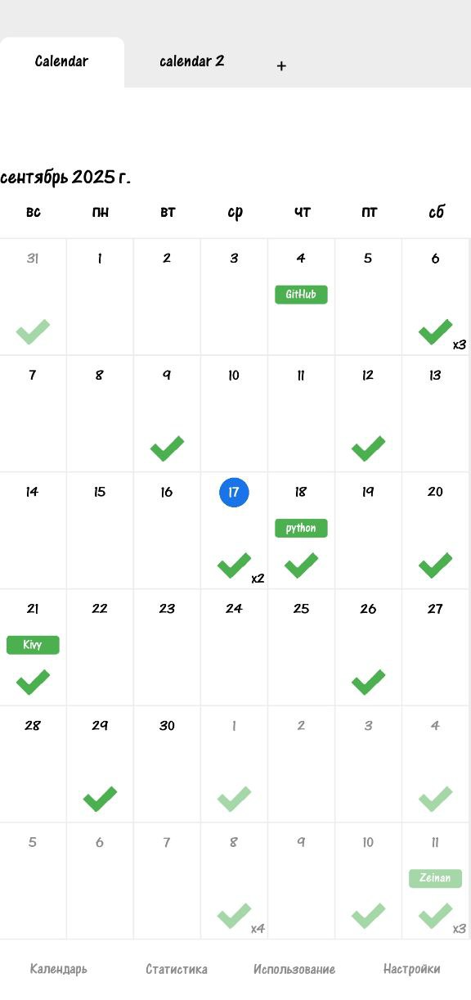
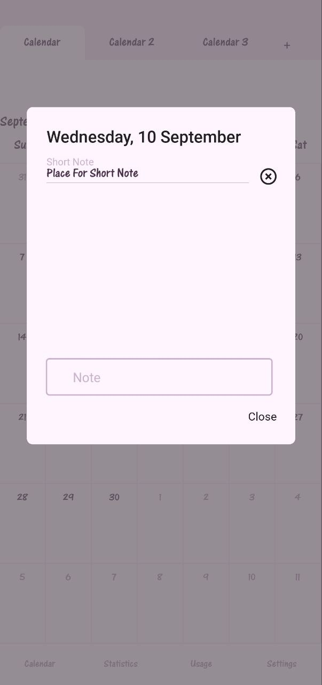

ZCalendar
====

Это мобильное приложение предназначено для отслеживания полезных привычек пользователей. Оно позволяет легко добавлять и редактировать привычки, а также визуализировать прогресс с помощью графиков и статистики.

Дата создания: 2024 год

### Функционал
- Добавление и редактирование привычек
- Визуализация прогресса с помощью графиков
- Возможность оставлять заметки
- Настройки интерфейса (выбор языка и темы)
- Поддержка нескольких календарей для разных привычек

### Технологии
- **Язык программирования:** Python
- **Фреймворк:** Kivy

### Компиляция
1. Откройте [Notebook в Google Colab](https://colab.research.google.com/drive/1BCzUSVXLnY3MPYJNyF2oE9bZaQhF5ljJ)
2. Выполните все команды

### Релизы
**[ZCalendar 0.4](https://github.com/Ze1nan/ZCalendar/releases/tag/v0.4)**

### Скриншоты

